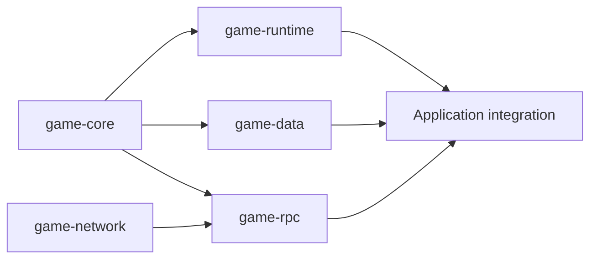

# OGBS 1.0 Specification Index

**[English](README.md)** | [简体中文](README.zh-CN.md)

**OGBS = Open Game Backend Specification**.

Every component requires both a **language-independent specification** and a **Java Development Specification**. This table is the canonical entry point. Both layers constrain Java implementations; signatures alone do not establish conformance.

| Component | Language-independent specification | Java 25 development specification | Implementation status |
| --- | --- | --- | --- |
| game-core | [Core Specification](OGBS-Core-1.0.md) | [Core Java Development Specification](OGBS-Core-Java-25-Specification-1.0.md) | Implemented; shared Metadata and error codes |
| game-runtime | [Runtime Specification](OGBS-Runtime-1.0.md) | [Runtime Java Development Specification](OGBS-Runtime-Java-25-Specification-1.0.md) | Implemented; Route, Context, Handler, Event, Timer/Cron |
| game-data | [Data Specification](OGBS-Data-1.0.md) | [Data Java Development Specification](OGBS-Data-Java-25-Specification-1.0.md) | Implemented; real MySQL/MongoDB validation requires configured services |
| game-network | [Network Specification](OGBS-Network-1.0.md) | [Network Java Development Specification](OGBS-Network-Java-25-Specification-1.0.md) | Implemented; TCP/TLS/WS/WSS |
| game-rpc | [RPC Specification](OGBS-RPC-1.0.md) | [RPC Java Development Specification](OGBS-RPC-Java-25-Specification-1.0.md) | Implemented; internal TCP, multiple Slots, calls, heartbeat/reconnection |

Specifications are version 1.0 repository drafts; Java modules are 1.0.0-SNAPSHOT on JDK 25. A specification's existence does not establish implementation or validation of every capability. Maintain status and limits accurately.

## Responsibilities of the two layers

| Document | Required coverage |
| --- | --- |
| Standard specification | Responsibilities/non-goals, data model, observable behavior, order, lifecycle, ownership, backpressure, errors/cancellation/time, compatibility, conformance |
| Java development specification | Corresponding standard, module/package/dependencies, public APIs, defaults/bounds, exceptions, thread/resource mechanisms, implementation constraints, extensions, examples/tests/unverified scope |
| Wire Profile | Cross-process fields, identifiers, byte order, lengths, encoding, version |
| Architecture and README | Composition, entry points, build instructions, specification links; no duplicated contracts |

Java development specifications include APIs but are more than API references. Java-specific techniques must not become obligations for other languages; shared behavior must not exist only in Java documents.

MUST indicates a conformance requirement; MUST NOT a prohibition; SHOULD a recommendation permitting justified exceptions; MAY an optional capability. Clause IDs support review/test mapping and are not runtime error codes.

Core is the sole source for shared Metadata and errors. [RPC Wire Profile](../rpc-wire.md) owns RPC bytes. [Architecture](../architecture.md) explains composition; [project README](../../README.md) provides build entry points.

## Maintenance and delivery rules

1. New components need paired standard/Java specifications linked here and in project/module READMEs.
2. Shared behavior changes update both layers. Java-only APIs, dependencies, threads, or configuration update the Java specification. Internal optimization without contract changes does not mechanically rewrite standards.
3. Fix implementation deviations. Explicit design changes synchronize rules, code, examples, and tests; never rewrite standards to hide defects.
4. Explain defaults, limits, failure paths, compatibility, and implementation/validation status, not only successful flows.
5. Maintain one semantic text in complete English and Chinese versions; remove superseded conclusions/dead links without competing specifications. Former Java API documents use Java-25-Specification filenames.
6. Documentation-only changes check pairs, naming, layering, and local links. Code changes test affected contracts; module changes run root mvn clean verify.

See [AGENTS.md](../../AGENTS.md) for collaboration rules. Mark complete runnable examples verified only after actually compiling and running them.

## Where to continue design work

The following links point into existing detailed flows, without creating extra specification copies. Read standard clauses for behavior, then Java chapters for implementation. The documentation should provide all the context maintainers need to continue implementation and review.

| Detail | Standard baseline | Java implementation entry |
| --- | --- | --- |
| Route, inline execution, queues, capacity | [Runtime §2–3](OGBS-Runtime-1.0.md#2-route-model) | [Runtime §7](OGBS-Runtime-Java-25-Specification-1.0.md#7-routeexecutor) |
| Context, Handler, events, cross-Route callbacks | [Runtime §5–8](OGBS-Runtime-1.0.md#5-context) | [Runtime §4–9](OGBS-Runtime-Java-25-Specification-1.0.md#4-context-and-scope) |
| Clock changes, Timer cancellation, Cron rescheduling | [Runtime §9](OGBS-Runtime-1.0.md#9-gametime-timer-and-cron) | [Runtime §10](OGBS-Runtime-Java-25-Specification-1.0.md#10-gametime-timer-and-cron) |
| Repository identity, cache, returned Map | [Data §2–5](OGBS-Data-1.0.md#2-identity) | [Data §2–4](OGBS-Data-Java-25-Specification-1.0.md#2-repository-api) |
| Coalescing, retries, error Handler, final closure | [Data §6–7](OGBS-Data-1.0.md#6-write-back-and-coalescing) | [Data §5](OGBS-Data-Java-25-Specification-1.0.md#5-write-back-implementation-and-limits) |
| MySQL/Mongo/log partitioning | [Data §8–9](OGBS-Data-1.0.md#8-storage-adapter-semantics) | [Data §6–8](OGBS-Data-Java-25-Specification-1.0.md#6-mysql-mapping) |
| Establishment, success/cancellation, resources | [Network §2,6](OGBS-Network-1.0.md#2-connection-establishment) | [Network §3–4,7](OGBS-Network-Java-25-Specification-1.0.md#3-server) |
| Send acceptance, backpressure, references, errors | [Network §3–5](OGBS-Network-1.0.md#3-reads-writes-acceptance-and-backpressure) | [Network §2,6](OGBS-Network-Java-25-Specification-1.0.md#2-connection-and-handler) |
| WebSocket, pipeline, handshake timeout | [Network §7](OGBS-Network-1.0.md#7-binary-websocket-profile) | [Network §5–6](OGBS-Network-Java-25-Specification-1.0.md#5-configuration-snapshots-and-handshake-parameters) |

### Continuing confirmed designs

Each standard's confirmed-tradeoffs table records rationale and revisit triggers. Clauses remain authoritative; timelines/examples explain them without creating another contract. New details identify affected clauses/Java sections and preserve unaffected baselines.

| Change | Handling |
| --- | --- |
| Add examples/rationale/failure explanation | Update original section; do not reopen confirmed choices |
| Add capability without changing existing behavior | State scope, parameters, failures, validation |
| Conflict with an existing clause | Explain conflict/impact, then implement the user's explicit choice |
| Implementation violates confirmed rules | Fix and test; do not redefine defects as design |
| No option selected yet | Mark undecided, not implemented or MUST |
| Implemented without environmental validation | Retain unverified status; prose does not replace tests |

Detailed specifications include prerequisites, full flow, result meaning, failure/closure/races, ownership, defaults, examples, rationale, and verification entry points. Java techniques/limitations belong in Java documents; cross-language observable behavior belongs in standards.

## Component composition

Arrows run from dependency to consumer. The root build includes Core, Runtime, Data, Network, and RPC. game-examples and automatic RPC→Runtime integration are unimplemented. Network and Runtime are independent; application integration owns business codecs, identity validation, Context creation, replies, and Route scheduling.

## Version and validation boundaries

Do not casually change used Metadata key encodings or error meanings. Breaking Wire changes require a new protocol version or explicit new Profile. Byte-format compatibility is established by the repository's Wire Profile and interoperability validation.

Each specification links sources/tests. Unit/integration success is not production-capacity certification. Report cross-language interoperability, public-network/native transport, real databases, and failure recovery separately.
