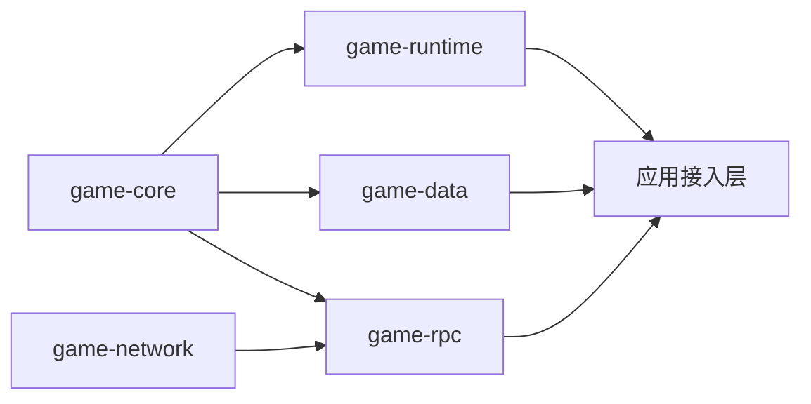

# OGBS 1.0 规范文档索引

[English](README.md) | **[简体中文](README.zh-CN.md)**

**OGBS = Open Game Backend Specification**（开放游戏后端规范）。

每个组件必须同时具有一份**标准规范**和一份**Java 开发规范**。下表是唯一规范入口；两层文档共同约束 Java 实现，不能仅凭 API 签名满足合规要求。

| 组件 | 标准规范（语言无关） | Java 25 开发规范 | 当前实现状态 |
| --- | --- | --- | --- |
| game-core | [Core Specification](OGBS-Core-1.0.zh-CN.md) | [Core Java Development Specification](OGBS-Core-Java-25-Specification-1.0.zh-CN.md) | 已实现；共享 Metadata 与错误码 |
| game-runtime | [Runtime Specification](OGBS-Runtime-1.0.zh-CN.md) | [Runtime Java Development Specification](OGBS-Runtime-Java-25-Specification-1.0.zh-CN.md) | 已实现；Route、Context、Handler、Event、Timer/Cron |
| game-data | [Data Specification](OGBS-Data-1.0.zh-CN.md) | [Data Java Development Specification](OGBS-Data-Java-25-Specification-1.0.zh-CN.md) | 已实现；真实 MySQL/MongoDB 验证需配置环境 |
| game-network | [Network Specification](OGBS-Network-1.0.zh-CN.md) | [Network Java Development Specification](OGBS-Network-Java-25-Specification-1.0.zh-CN.md) | 已实现；TCP/TLS/WS/WSS |
| game-rpc | [RPC Specification](OGBS-RPC-1.0.zh-CN.md) | [RPC Java Development Specification](OGBS-RPC-Java-25-Specification-1.0.zh-CN.md) | 已实现；内部 TCP、多 Slot、调用、心跳/重连 |

规范版本为 1.0，当前处于仓库草案阶段；Java 模块版本为 1.0.0-SNAPSHOT，基线 JDK 25。规范存在不代表所有能力均已实现或验证，各文档的状态与边界必须据实维护。

## 两层规范的职责

| 文档 | 必须覆盖的内容 |
| --- | --- |
| 标准规范 | 职责与非目标、数据模型、可观察行为、顺序、生命周期、所有权、背压、错误/取消/时间、兼容性和合规检查 |
| Java 开发规范 | 对应标准、模块/包/依赖、公共 API、默认配置和参数边界、异常形式、线程/资源机制、实现约束、扩展接入、示例与测试/未验证范围 |
| Wire Profile | 跨进程字段、标识、字节序、长度、编码和协议版本 |
| 架构与 README | 组件组合、使用入口、构建方式和上述规范链接，不重复定义契约 |

Java 开发规范包含 API，但不止是 API 参考。语言相关实现方式不能提升为其他语言必须遵守的要求；通用行为也不能只写在 Java 文档中。

MUST / 必须表示合规要求；MUST NOT / 不得表示禁止行为；SHOULD / 应表示可说明理由的推荐；MAY / 可以表示可选能力。条款 ID 用于审查与验证映射，不是运行时错误码。

共享 Metadata 和错误码以 Core 标准为单一来源。RPC 字节格式以 [RPC Wire Profile](../rpc-wire.zh-CN.md) 为单一来源；[架构总览](../architecture.zh-CN.md) 解释组件组合，[项目 README](../../README.zh-CN.md) 提供构建入口。

## 维护与交付规则

1. 新增组件时成对创建标准规范和 Java 开发规范，并加入本索引及项目/模块 README。
2. 通用行为变化同步两层；仅 Java API、依赖、线程或配置变化更新 Java 开发规范；内部优化没有契约变化时不机械改写标准。
3. 规范与实现不符时修正实现；明确改变设计时同步规则、代码、示例与测试，不为掩盖缺陷反向修改标准。
4. 文档必须说明默认值、边界、失败路径、兼容性影响及实现/验证状态，不只写理想成功流程。
5. 维护同一语义正文的完整中英文版本，移除旧结论与失效链接，不保留相互竞争的平行规范。原 Java API 文档已统一迁移到 Java-25-Specification 文件名。
6. 仅文档修改检查配对、命名、内容分层与本地链接；代码变化按受影响契约测试，模块调整从根运行 mvn clean verify。

具体协作规则见 [AGENTS.md](../../AGENTS.zh-CN.md)。完整可运行示例必须实际编译和运行后才标注已验证。

## 继续设计时从哪里开始

以下导航对应现有正文中的详细流程，不建立新的规范副本。先读标准条款确定行为，再读 Java 章节确定实现；未参与历史聊天的维护者也应能据此继续工作。

| 需要补充的细节 | 标准中的基线 | Java 中的实现入口 |
| --- | --- | --- |
| Route、内联、排队、容量 | [Runtime §2–3](OGBS-Runtime-1.0.zh-CN.md#2-route-模型) | [Runtime §7](OGBS-Runtime-Java-25-Specification-1.0.zh-CN.md#7-routeexecutor) |
| Context、Handler、事件、跨 Route 回调 | [Runtime §5–8](OGBS-Runtime-1.0.zh-CN.md#5-context) | [Runtime §4–9](OGBS-Runtime-Java-25-Specification-1.0.zh-CN.md#4-context-与作用域) |
| 改钟、Timer 取消、Cron 重排 | [Runtime §9](OGBS-Runtime-1.0.zh-CN.md#9-gametimetimer-与-cron) | [Runtime §10](OGBS-Runtime-Java-25-Specification-1.0.zh-CN.md#10-gametimetimer-与-cron) |
| Repository 身份、缓存、返回 Map | [Data §2–5](OGBS-Data-1.0.zh-CN.md#2-身份) | [Data §2–4](OGBS-Data-Java-25-Specification-1.0.zh-CN.md#2-repository-api) |
| 合并、重试、错误 Handler、最终关闭 | [Data §6–7](OGBS-Data-1.0.zh-CN.md#6-写回与合并) | [Data §5](OGBS-Data-Java-25-Specification-1.0.zh-CN.md#5-写回实现与适用边界) |
| MySQL/Mongo/日志分表 | [Data §8–9](OGBS-Data-1.0.zh-CN.md#8-存储适配语义) | [Data §6–8](OGBS-Data-Java-25-Specification-1.0.zh-CN.md#6-mysql-映射) |
| 建连、成功/取消竞争、资源归属 | [Network §2、6](OGBS-Network-1.0.zh-CN.md#2-连接建立) | [Network §3–4、7](OGBS-Network-Java-25-Specification-1.0.zh-CN.md#3-server) |
| 发送接纳、背压、消息引用、错误回调 | [Network §3–5](OGBS-Network-1.0.zh-CN.md#3-读写接纳与背压) | [Network §2、6](OGBS-Network-Java-25-Specification-1.0.zh-CN.md#2-connection-与-handler) |
| WebSocket、pipeline、握手超时 | [Network §7](OGBS-Network-1.0.zh-CN.md#7-binary-websocket-profile) | [Network §5–6](OGBS-Network-Java-25-Specification-1.0.zh-CN.md#5-配置快照与握手参数) |

### 已确认设计如何延续

各标准 Spec 的“已确认设计取舍”表记录采用理由和重新评估条件。规则本身仍以相应条款为准，解释性时间线和例子帮助理解，不引入另一套契约。未来补一项细节时应注明受影响的条款和 Java 章节，直接沿用未受影响的基线。

| 变更情况 | 处理方式 |
| --- | --- |
| 只是补充已有规则的例子、原因、失败解释 | 更新原章节，不重新讨论已确认选择 |
| 新增能力且不改变既有行为 | 明确新增范围、参数、失败与验证要求 |
| 与既有条款冲突 | 说明冲突与影响，再落实用户明确选择的设计 |
| 实现违反已确定规则 | 修正实现并验证，不能把缺陷改写成设计 |
| 尚未选择方案 | 标为待决定，不伪装成已实现或 MUST |
| 已实现但没有相应环境验证 | 保留未验证说明，不用文档补全代替测试 |

详细规范应包括前置条件、完整流程、结果含义、失败/关闭/竞争边界、所有权、默认值、例子、理由与验证入口。Java 技巧和已知实现限制留在 Java 文档；跨语言可观察行为留在标准中。

## 组件组合

箭头由被依赖组件指向使用方。当前根构建包含 Core、Runtime、Data、Network、RPC；game-examples 与自动 RPC→Runtime 接入尚未实现。Network 和 Runtime 相互独立，应用接入层负责业务编解码、身份校验、Context 构造、回复及 Route 调度。

## 版本与验证边界

已使用的 Metadata Key 编码和错误码含义不得随意改变；破坏 Wire 的变更须使用新协议版本或明确的新 Profile。历史聊天附件未导入仓库，不据此声称与旧附件的字节格式兼容。

各规范列出对应源码与测试。单元/集成测试通过不等于生产容量认证，跨语言互操作、公网/native transport、实机数据库与故障恢复须分别报告验证状态。
