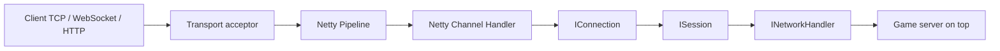
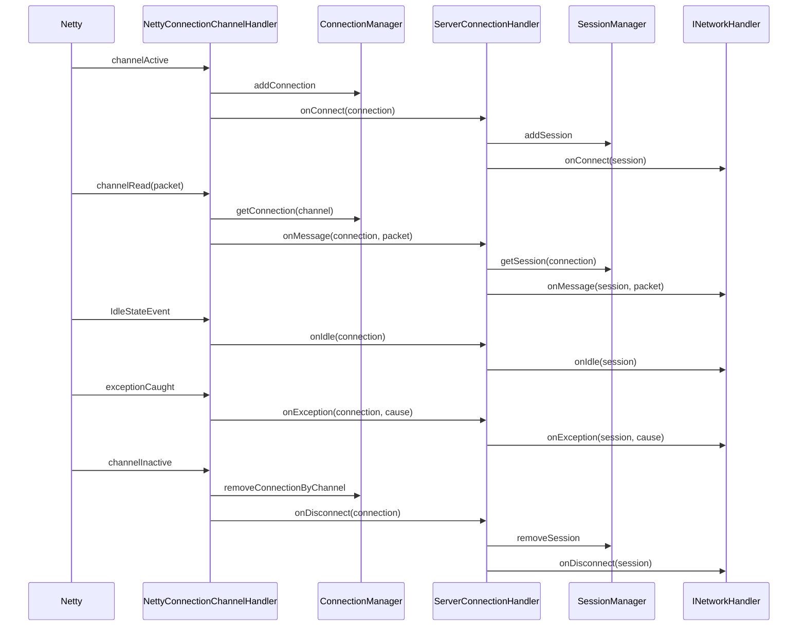

[中文](README.md) | English

# game-network

`game-network` is a lightweight game server network framework. Its boundary is deliberately kept small: it accepts connections, manages connection/session lifecycles, runs the transport-layer pipeline, and delivers network events and decoded messages to `INetworkHandler`. HTTP requests/responses go through a separate `IHttpHandler`.

The framework does not handle game protocol routing, command dispatch, player business logic, or room/scene scheduling. Those responsibilities belong to the game business modules above it.

## Architectural Boundary



## Modules

- `game-network-core`
  - Defines the transport-agnostic core contracts.
  - Provides `IConnection`, `ISession`, connection/session managers, and the lifecycle bridge interfaces.
- `game-network-netty`
  - Adapts Netty `Channel` events to the core-layer contracts.
  - Provides the TCP/WebSocket connection implementations and pipeline extension points.

## Core Responsibilities

The network framework is responsible for:

- Accepting TCP/WebSocket connections.
- Accepting HTTP/1.1 and HTTP/2 h2c requests.
- Creating and maintaining `IConnection`.
- Creating and maintaining `ISession`.
- Forwarding connection lifecycle events to `INetworkHandler`.
- Forwarding inbound messages to `INetworkHandler.onMessage(session, packet)`.
- Providing outbound message sending via `session.writeMsg(...)`.
- `ISession` defines no business-level unique identifier and carries no business attributes; player ID, account ID, login state and other business context are maintained by the layers above.
- Closing connections and sessions cleanly.
- Providing pipeline slots for SSL, IP filtering, traffic control, framing, idle detection, codecs, metrics, and the business delivery handler.

The network framework is NOT responsible for:

- Game protocol routing.
- Command handler lookup.
- Player login semantics.
- Room, battle, scene, or actor scheduling.
- Cross-server RPC.
- Persistence.
- Business retries or game transaction logic.

## Lifecycle Flow



## The `INetworkHandler` Contract

Upper-layer modules plug into the network framework by implementing `INetworkHandler`:

```java
public interface INetworkHandler {

    void onConnect(ISession session);

    void onMessage(ISession session, Object packet);

    void onDisconnect(ISession session);

    void onException(ISession session, Throwable cause);

    default boolean onIdle(ISession session) {
        return false;
    }
}
```

The return value of `onIdle` tells the framework whether to close the session. Returning `true` makes the framework close the session; returning `false` keeps the connection open and leaves the follow-up handling to the business layer.

## Pipeline Model

Pipeline handlers are ordered by the priorities defined in `PipelineConstants`:

| Priority | Stage |
| --- | --- |
| `100` | SSL |
| `200` | IP filtering |
| `300` | Traffic control |
| `350` | Metrics |
| `400` | Framing |
| `500` | Idle detection |
| `600` | Codec |
| `700` | Auth hook |
| `1000` | Business delivery |

The business delivery stage is still just a network-layer bridge: it should only invoke `INetworkHandler` and must not perform game command routing inside `game-network`.

## Phase 1 Completed

Phase 1 focused on stabilizing the existing skeleton:

- Forward connection idle events to `INetworkHandler`.
- Lifecycle methods handle missing sessions.
- Avoid firing disconnect handling twice.
- Use a connection ID generator instead of `channel.id().hashCode()`.
- Extend `ConnectionManager`.
- Extend `SessionManager`.

## Phase 2 Completed

Phase 2 made the framework able to start a real TCP service:

- Added `INetworkServer` to unify the network service lifecycle:
  - `start()`
  - `stop()`
- Added `NetworkServerConfig` (abstract base class) with transport settings shared by all protocols:
  - `host`
  - `port`
  - `bossThreads`
  - `workerThreads`
  - `idleSeconds`
  - `tcpNoDelay`
  - `soBacklog`
- Split out three concrete config subclasses per protocol; protocol-specific fields live in their own class, and server constructor parameters are narrowed accordingly (type match is guaranteed at compile time — no more runtime `connectionType` checks):
  - `NetworkTcpServerConfig`: no extra fields, reserved as the home for TCP-specific settings
  - `NetworkWsServerConfig`: `websocketPath`, `httpMaxContentLength`
  - `NetworkHttpServerConfig`: `httpMaxContentLength`, `httpProtocol`
- Added `NettyTcpServer`, which owns the Netty `ServerBootstrap`, `EventLoopGroup`, port binding and graceful shutdown.
- Added `DefaultTcpPipelineConfigurator`, which installs:
  - `NettyConnectionChannelHandler`
- `IdleStateHandler` is not hard-wired into the default TCP pipeline. When idle detection is needed, the upper layer adds it via a custom `IPipelineConfigurator` (just implement `IPipelineConfigurator`; no framework object is required).

`DefaultTcpPipelineConfigurator` itself only installs the business delivery handler. With `new NettyTcpServer(config, handler)` the framework applies no default codec, so whatever the upstream Netty pipeline produces goes straight into `INetworkHandler.onMessage(session, packet)`. Without a custom decoder, TCP inbound is typically a `ByteBuf`.

## Phase 3 Completed

Phase 3 focused on the codec boundary, pipeline composition and basic tests:

- No packet encoder/decoder wrapping. Users fully own encoding and decoding with plain Netty handlers in the pipeline.
- Whatever the custom decoder outputs is exactly what `INetworkHandler.onMessage(...)` receives; whatever the custom encoder outputs is exactly what Netty keeps writing downstream.
- The default path never copies or converts `ByteBuf`, preserving Netty-native performance.
- If the business wants `byte[]`, add `ByteArrayCodecPipelineConfigurator` explicitly:
  - inbound `ByteBuf` -> `byte[]`
  - outbound `byte[]` -> `ByteBuf`
- Added pipeline composition:
  - `CompositePipelineConfigurator`
  - `ByteArrayCodecPipelineConfigurator`
- Added basic tests:
  - `ConnectionManager`
  - `SessionManager`
  - `NetworkServerConfig`
  - byte[] codec handler
  - pipeline composers
  - `NettyTcpServer` TCP echo integration test

If a `ByteBuf` reaches `INetworkHandler` directly, releasing it is the business layer's responsibility; decoding into business objects with a custom Netty handler in the pipeline is the recommended approach.

## Phase 4 Completed

Phase 4 added WebSocket support while keeping TCP / WebSocket on the same lifecycle:

- Added `NettyWebSocketServer`.
- The default WebSocket pipeline contains:
  - `HttpServerCodec`
  - `HttpObjectAggregator`
  - `WebSocketServerProtocolHandler`
  - `WebSocketFrameToPacketDecoder`
  - `PacketToWebSocketFrameEncoder`
  - `WebsocketConnectionChannelHandler`
- `INetworkHandler.onConnect(session)` fires only after the WebSocket handshake completes.
- Default conversions between WebSocket frames and business packets:
  - `BinaryWebSocketFrame` -> `ByteBuf`
  - `TextWebSocketFrame` -> `String`
  - outbound `ByteBuf` / `byte[]` -> `BinaryWebSocketFrame`
  - outbound `String` -> `TextWebSocketFrame`
- TCP / WebSocket share:
  - `ISession`
  - `IConnection`
  - `INetworkHandler`

## Phase 5 Completed

Phase 5 added HTTP support and upgraded Netty to `4.2.15.Final`:

- Added `NettyHttpServer`.
- Added HTTP protocol options:
  - `HTTP1`
  - `HTTP2`
  - `HTTP1_AND_HTTP2`
- Added standalone HTTP contracts:
  - `IHttpHandler`
  - `IHttpExchange`
- The HTTP/1.1 pipeline contains:
  - `HttpServerCodec`
  - `HttpObjectAggregator`
  - `NettyHttpDispatcher`
- The HTTP/2 h2c pipeline contains:
  - `Http2FrameCodec`
  - `Http2MultiplexHandler`
  - `Http2StreamFrameToHttpObjectCodec` per stream
  - `HttpObjectAggregator`
  - `NettyHttpDispatcher`
- HTTP does not reuse `INetworkHandler`, `ISession`, or `IConnection`, to avoid forcing the HTTP/2 stream request model into the long-connection message model.
- HTTP/2 currently supports cleartext h2c; TLS + ALPN can be added later as an independent capability.

## TCP Server Example

```java
NetworkTcpServerConfig config = new NetworkTcpServerConfig(9000);
config.setHost("0.0.0.0");

INetworkHandler handler = new INetworkHandler() {
    @Override
    public void onConnect(ISession session) {
    }

    @Override
    public void onMessage(ISession session, Object packet) {
        session.writeMsg(packet);
    }

    @Override
    public void onDisconnect(ISession session) {
    }

    @Override
    public void onException(ISession session, Throwable cause) {
    }

    @Override
    public boolean onIdle(ISession session) {
        return true;
    }
};

INetworkServer server = new NettyTcpServer(config, handler);
server.start();
```

## WebSocket Server Example

```java
NetworkWsServerConfig config = new NetworkWsServerConfig(9000);
config.setHost("0.0.0.0");
config.setWebsocketPath("/ws");

INetworkHandler handler = new INetworkHandler() {
    @Override
    public void onConnect(ISession session) {
    }

    @Override
    public void onMessage(ISession session, Object packet) {
        session.writeMsg(packet);
    }

    @Override
    public void onDisconnect(ISession session) {
    }

    @Override
    public void onException(ISession session, Throwable cause) {
    }
};

INetworkServer server = new NettyWebSocketServer(config, handler);
server.start();
```

## HTTP Server Example

```java
NetworkHttpServerConfig config = new NetworkHttpServerConfig(8080);
config.setHost("0.0.0.0");
config.setHttpProtocol(HttpProtocol.HTTP1_AND_HTTP2);

IHttpHandler handler = exchange -> {
    exchange.writeResponse(200, "ok");
};

INetworkServer server = new NettyHttpServer(config, handler);
server.start();
```

## Custom Codecs

The upper layer writes its own Netty encoder/decoder handlers and simply adds them in. The network framework does not care about the protocol format and adds no extra encoder/decoder wrapping; whatever the handlers output is what flows through:

```java
IPipelineConfigurator codecPipeline = pipeline -> {
    pipeline.addLast(PipelineConstants.NAME_DECODER, new MyPacketDecoder());
    pipeline.addLast(PipelineConstants.NAME_ENCODER, new MyPacketEncoder());
};

INetworkServer server = new NettyTcpServer(config, handler, codecPipeline);
server.start();
```

Framing, heartbeat, metrics and other handlers are added the same way — keep calling `addLast(...)` on the same pipeline.

## Custom Idle Detection

Idle detection works the same way — add the Netty handler directly:

```java
IPipelineConfigurator idlePipeline = pipeline -> {
    pipeline.addLast(PipelineConstants.NAME_IDLE_STATE,
            new IdleStateHandler(30, 0, 0, TimeUnit.SECONDS));
};

INetworkServer server = new NettyTcpServer(config, handler, idlePipeline);
server.start();
```
