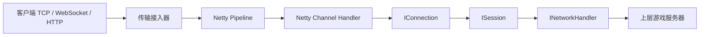
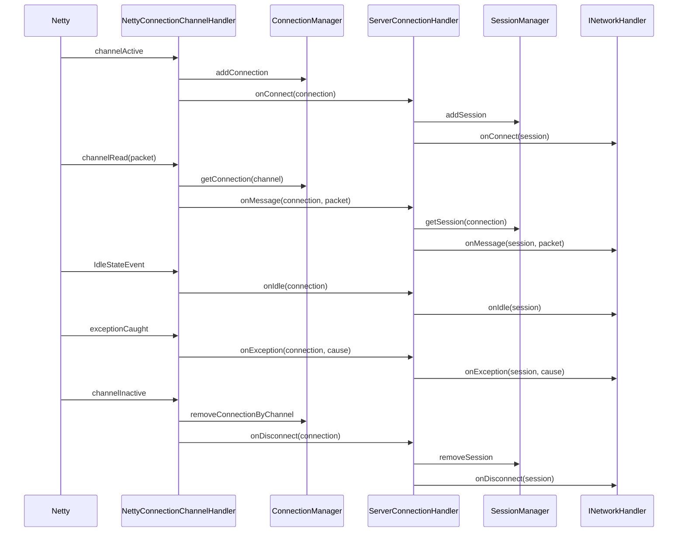

# game-network

`game-network` 是一个轻量级游戏服务器网络框架。它的边界刻意保持精简：负责接入连接、管理连接/会话生命周期、执行传输层 pipeline，并把网络事件和已解码的消息投递给 `INetworkHandler`。HTTP 请求/响应使用独立的 `IHttpHandler`。

框架不负责游戏协议路由、命令分发、玩家业务逻辑，也不负责房间/场景调度。这些职责都属于上层游戏业务模块。

## 架构边界



## 模块划分

- `game-network-core`
  - 定义与传输实现无关的核心契约。
  - 提供 `IConnection`、`ISession`、连接/会话管理器，以及生命周期桥接接口。
- `game-network-netty`
  - 将 Netty `Channel` 事件适配为 core 层契约。
  - 提供 TCP/WebSocket 连接实现和 pipeline 扩展点。

## 核心职责

网络框架负责：

- 接入 TCP/WebSocket 连接。
- 接入 HTTP/1.1 和 HTTP/2 h2c 请求。
- 创建并维护 `IConnection`。
- 创建并维护 `ISession`。
- 将连接生命周期事件转发给 `INetworkHandler`。
- 将收到的消息转发给 `INetworkHandler.onMessage(session, packet)`。
- 通过 `session.writeMsg(...)` 提供出站消息发送能力。
- `ISession` 不定义业务唯一标识，也不承载业务属性；玩家 ID、账号 ID、登录态等业务上下文由上层模块自行维护。
- 干净地关闭连接和会话。
- 为 SSL、IP 过滤、流量控制、拆包粘包、空闲检测、编解码、指标统计、业务投递 handler 提供 pipeline 插槽。

网络框架不负责：

- 游戏协议路由。
- 命令 handler 查找。
- 玩家登录语义。
- 房间、战斗、场景或 actor 调度。
- 跨服 RPC。
- 持久化。
- 业务重试或游戏事务逻辑。

## 生命周期流程



## `INetworkHandler` 契约

上层模块通过实现 `INetworkHandler` 接入网络框架：

```java
public interface INetworkHandler {

    void onConnect(ISession session);

    void onMessage(ISession session, Object packet);

    void onDisconnect(ISession session);

    void onException(ISession session, Throwable cause);

    default boolean onIdle(ISession session) {
        return false;
    }
}
```

`onIdle` 的返回值表示框架是否需要关闭会话。返回 `true` 时框架关闭会话；返回 `false` 时连接保持打开，由上层业务自行决定后续处理。

## Pipeline 模型

Pipeline handler 按 `PipelineConstants` 中定义的优先级排序：

| 优先级 | 阶段 |
| --- | --- |
| `100` | SSL |
| `200` | IP 过滤 |
| `300` | 流量控制 |
| `350` | 指标统计 |
| `400` | 拆包粘包 |
| `500` | 空闲检测 |
| `600` | 编解码 |
| `700` | 认证钩子 |
| `1000` | 业务投递 |

这里的业务投递仍然只是网络层桥接：它只应该调用 `INetworkHandler`，不应该在 `game-network` 内部执行游戏命令路由。

## 第一阶段已完成

第一阶段聚焦于稳定现有骨架：

- 将连接空闲事件转发给 `INetworkHandler`。
- 生命周期方法处理缺失 session 的情况。
- 避免重复触发断开处理。
- 使用连接 ID 生成器替代 `channel.id().hashCode()`。
- 扩展 `ConnectionManager`。
- 扩展 `SessionManager`。

## 第二阶段已完成

第二阶段让网络框架具备可启动的 TCP 服务能力：

- 增加 `INetworkServer`，统一网络服务生命周期：
  - `start()`
  - `stop()`
- 增加 `NetworkServerConfig`（抽象基类），提供各协议共用的传输配置：
  - `host`
  - `port`
  - `bossThreads`
  - `workerThreads`
  - `idleSeconds`
  - `tcpNoDelay`
  - `soBacklog`
- 按协议拆出三个具体配置子类，协议特有字段各归各类，服务端构造参数也按子类收窄（编译期保证类型匹配，不再运行时校验 `connectionType`）：
  - `NetworkTcpServerConfig`：无额外字段，留作 TCP 专属配置的落点
  - `NetworkWsServerConfig`：`websocketPath`、`httpMaxContentLength`
  - `NetworkHttpServerConfig`：`httpMaxContentLength`、`httpProtocol`
- 增加 `NettyTcpServer`，负责 Netty `ServerBootstrap`、`EventLoopGroup`、端口绑定和优雅关闭。
- 增加 `DefaultTcpPipelineConfigurator`，负责加入：
  - `NettyConnectionChannelHandler`
- `IdleStateHandler` 不写死在默认 TCP pipeline 中。需要空闲检测时，上层通过自定义 `IPipelineConfigurator` 添加（实现 `IPipelineConfigurator` 即可，无需依赖任何框架对象）。

`DefaultTcpPipelineConfigurator` 本身只负责业务投递 handler。使用 `new NettyTcpServer(config, handler)` 时，框架不做默认编解码，Netty pipeline 上游传下来的对象会原样进入 `INetworkHandler.onMessage(session, packet)`。如果没有自定义解码，TCP 入站通常是 `ByteBuf`。

## 第三阶段已完成

第三阶段聚焦编解码边界、pipeline 组合和基础测试：

- 不封装 packet encoder/decoder。用户完全自定义编码和解码，直接在 pipeline 中使用 Netty handler。
- 用户自定义 decoder 输出什么，`INetworkHandler.onMessage(...)` 就收到什么；用户自定义 encoder 输出什么，Netty 就继续向后写什么。
- 默认路径不复制、不转换 `ByteBuf`，保持 Netty 原生性能边界。
- 如果业务想使用 `byte[]`，可以显式添加 `ByteArrayCodecPipelineConfigurator`：
  - 入站 `ByteBuf` 转为 `byte[]`
  - 出站 `byte[]` 转为 `ByteBuf`
- 增加 pipeline 组合能力：
  - `CompositePipelineConfigurator`
  - `ByteArrayCodecPipelineConfigurator`
- 增加基础测试：
  - `ConnectionManager`
  - `SessionManager`
  - `NetworkServerConfig`
  - byte[] codec handler
  - pipeline 组合器
  - `NettyTcpServer` TCP echo 集成测试

如果 `ByteBuf` 直接进入 `INetworkHandler`，释放责任由业务处理；更推荐在 pipeline 中用自定义 Netty handler 解码成业务对象。

## 第四阶段已完成

第四阶段增加 WebSocket 支持，同时保持 TCP / WebSocket 共用同一套生命周期：

- 增加 `NettyWebSocketServer`。
- 默认 WebSocket pipeline 包含：
  - `HttpServerCodec`
  - `HttpObjectAggregator`
  - `WebSocketServerProtocolHandler`
  - `WebSocketFrameToPacketDecoder`
  - `PacketToWebSocketFrameEncoder`
  - `WebsocketConnectionChannelHandler`
- WebSocket 握手完成后才触发 `INetworkHandler.onConnect(session)`。
- WebSocket frame 和业务 packet 的默认转换：
  - `BinaryWebSocketFrame` -> `ByteBuf`
  - `TextWebSocketFrame` -> `String`
  - 出站 `ByteBuf` / `byte[]` -> `BinaryWebSocketFrame`
  - 出站 `String` -> `TextWebSocketFrame`
- TCP / WebSocket 统一使用：
  - `ISession`
  - `IConnection`
  - `INetworkHandler`

## 第五阶段已完成

第五阶段增加 HTTP 支持，并将 Netty 升级到 `4.2.15.Final`：

- 增加 `NettyHttpServer`。
- 增加 HTTP 协议配置：
  - `HTTP1`
  - `HTTP2`
  - `HTTP1_AND_HTTP2`
- 增加独立 HTTP 契约：
  - `IHttpHandler`
  - `IHttpExchange`
- HTTP/1.1 pipeline 包含：
  - `HttpServerCodec`
  - `HttpObjectAggregator`
  - `NettyHttpDispatcher`
- HTTP/2 h2c pipeline 包含：
  - `Http2FrameCodec`
  - `Http2MultiplexHandler`
  - 每个 stream 内使用 `Http2StreamFrameToHttpObjectCodec`
  - `HttpObjectAggregator`
  - `NettyHttpDispatcher`
- HTTP 不复用 `INetworkHandler`、`ISession`、`IConnection`，避免把 HTTP/2 stream 请求模型塞进长连接消息模型。
- 当前 HTTP/2 支持明文 h2c；TLS + ALPN 可以作为后续独立能力添加。

## TCP Server 示例

```java
NetworkTcpServerConfig config = new NetworkTcpServerConfig(9000);
config.setHost("0.0.0.0");

INetworkHandler handler = new INetworkHandler() {
    @Override
    public void onConnect(ISession session) {
    }

    @Override
    public void onMessage(ISession session, Object packet) {
        session.writeMsg(packet);
    }

    @Override
    public void onDisconnect(ISession session) {
    }

    @Override
    public void onException(ISession session, Throwable cause) {
    }

    @Override
    public boolean onIdle(ISession session) {
        return true;
    }
};

INetworkServer server = new NettyTcpServer(config, handler);
server.start();
```

## WebSocket Server 示例

```java
NetworkWsServerConfig config = new NetworkWsServerConfig(9000);
config.setHost("0.0.0.0");
config.setWebsocketPath("/ws");

INetworkHandler handler = new INetworkHandler() {
    @Override
    public void onConnect(ISession session) {
    }

    @Override
    public void onMessage(ISession session, Object packet) {
        session.writeMsg(packet);
    }

    @Override
    public void onDisconnect(ISession session) {
    }

    @Override
    public void onException(ISession session, Throwable cause) {
    }
};

INetworkServer server = new NettyWebSocketServer(config, handler);
server.start();
```

## HTTP Server 示例

```java
NetworkHttpServerConfig config = new NetworkHttpServerConfig(8080);
config.setHost("0.0.0.0");
config.setHttpProtocol(HttpProtocol.HTTP1_AND_HTTP2);

IHttpHandler handler = exchange -> {
    exchange.writeResponse(200, "ok");
};

INetworkServer server = new NettyHttpServer(config, handler);
server.start();
```

## 自定义编解码

上层直接写自己的 Netty 编码、解码 handler，使用时添加进去即可。网络框架不关心协议格式，也不额外包装 encoder/decoder；handler 输出什么就是什么：

```java
IPipelineConfigurator codecPipeline = pipeline -> {
    pipeline.addLast(PipelineConstants.NAME_DECODER, new MyPacketDecoder());
    pipeline.addLast(PipelineConstants.NAME_ENCODER, new MyPacketEncoder());
};

INetworkServer server = new NettyTcpServer(config, handler, codecPipeline);
server.start();
```

如果还需要拆包、心跳、指标等 handler，也是在同一个 pipeline 里继续 `addLast(...)`。

## 自定义空闲检测

空闲检测也是同样方式，直接添加 Netty handler：

```java
IPipelineConfigurator idlePipeline = pipeline -> {
    pipeline.addLast(PipelineConstants.NAME_IDLE_STATE,
            new IdleStateHandler(30, 0, 0, TimeUnit.SECONDS));
};

INetworkServer server = new NettyTcpServer(config, handler, idlePipeline);
server.start();
```
